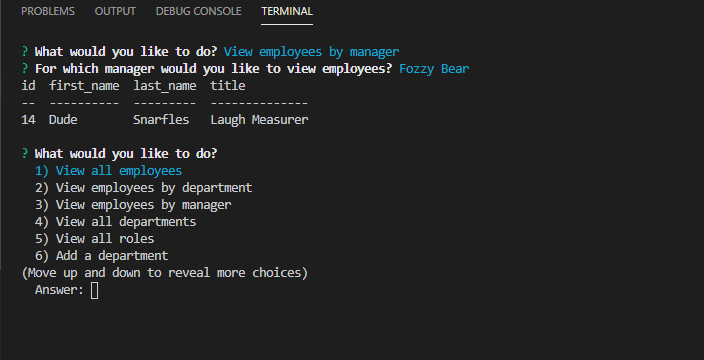
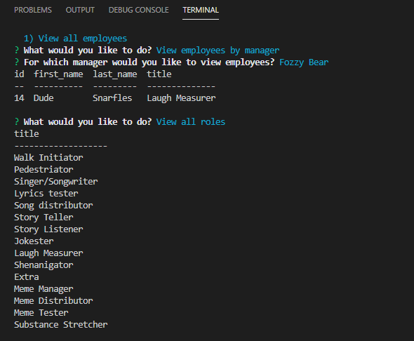

# Employee Management Application

## Table of Contents

[Project Description](#description)
 
[Installation Guide](#installation-guide)

[Usage Iinformation](#usage-information)

[Contribution Guidelines](#contribution-guidelines)

[Testing Instructions](#testing-instructions)

[License Information](#license-information)

[Questions](#questions)

## [Demonstration video](https://drive.google.com/file/d/1XNVw1A5RCoR3qfsg63vZ_WR7Y6R1Cjlh/view)

## Description

Employee management app using Node, Inquirer, and MySQL.

## Installation Guide

npm i

## Usage Information

node index.js

## Contribution Guidelines

Feel free to contact me through my github or by email which can be found below.

## Testing Instructions

n/a

## License Information

Notice: This application is covered under the MIT license.

 [License: MIT](https://opensource.org/licenses/MIT)

## Questions

If you have any questions, please feel free to reach out via one of the following avenues.

#### Contact info

[My GitHub](https://github.com/maggiemaywilder)

[My email](mailto:maggiemaywilder@gmail.com)
